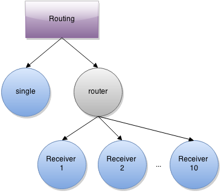

```
██████████╗  █████████╗     █████╗██╗  ████╗  ██╗█████╗     ██╗     █████╗██████╗
╚══██╔══██║  ████╔════╝    ██╔══████║ ██╔██║ ██╔██╔══██╗    ██║    ██╔══████╔══██╗
   ██║  ████████████╗      ████████████╔╝█████╔╝███████║    ██║    █████████████╔╝
   ██║  ██╔══████╔══╝      ██╔══████╔═██╗██╔═██╗██╔══██║    ██║    ██╔══████╔══██╗
   ██║  ██║  █████████╗    ██║  ████║  ████║  ████║  ██║    █████████║  ████████╔╝
   ╚═╝  ╚═╝  ╚═╚══════╝    ╚═╝  ╚═╚═╝  ╚═╚═╝  ╚═╚═╝  ╚═╝    ╚══════╚═╝  ╚═╚═════╝
```

# Reactive Programming with Akka and Scala
## High performant and scalable Applications

During our Lab we wanted to try implementing an application with Akka and Scala, because we're going to evaluate performant and scalable software architectures on the JVM.

In this blog we're describing how to setup an Akka app and showing a very basic demo.

## Bootrapping an Akka/Scala app

The basic setup of the application is quite simple. We're using `sbt` as build tool and therefor we need to create [build.sbt](build.sbt) and add the needed akka artifacts as dependency:

```
name := "The Akka Lab"

version := "0.1"

scalaVersion := "2.10.3"

libraryDependencies ++= Seq(
  "com.typesafe.akka" %% "akka-actor" % "2.2.3",
  "com.typesafe.akka" %% "akka-testkit" % "2.2.3",
  "org.scalatest" %% "scalatest" % "2.0" % "test",
)
```

You can easily import the project into IntelliJ or use sbt plugins to generate project files for your prefered IDE:

- [IntelliJ: sbt-idea](https://github.com/mpeltonen/sbt-idea) 
- [Eclipse: sbteclipse](https://github.com/typesafehub/sbteclipse)

### Simple Message passing

After importing the project we're implementing our first basic ActorSystem. It's structure will look as depicted below:



We have want to create a single ActorSystem called **routing** having a `Receiver` Actor called **single** next to a `RoundRobinRouter` **router** with 10 children of type `Receiver`. All we need to do is creating instantiating the system and creating both the children **single** and **router**. The `RoundRobinRouter` creates it's children by itself:

```
	import scala.concurrent.duration._
    val duration = 3.seconds
    implicit val timeout = Timeout(duration)

    val sys = ActorSystem("Routing")

    val single = sys.actorOf(Props[Receiver](new Receiver(2.seconds.toMillis)), "single")
    val router = sys.actorOf(Props[Receiver].withRouter(RoundRobinRouter(nrOfInstances = 10)), "router")
```

The [`Reciever`](demo/RoutingStrategies.scala) is does recieve messages of type `Message(String)` and prints whatever the message parameter is. After recieving a message we're toggeling the state of our reciever by using Akka's `become` mechanism. So here is the definition of our `Reciever` actor:

```
  object Receiver {
    case class Message(msg: String)
  }

  class Receiver(timeout: Long) extends Actor with ActorLogging {
    import demo.RoutingStrategies.Receiver._
    
    def this() = this(1000)

    override def receive = fastReceive

    def fastReceive: Receive = {
      case Message(m)=> {
        log.info(m)

        context.become(slowReceive)
      }
    }

    def slowReceive: Receive = {
      case Message(m) => {
        Thread.sleep(timeout)

        log.info(s"Slow: $m")

        context.become(fastReceive)
      }
    }
  }
```


### Aside: Typesafe Config

### PingPong: Remote Messages

## The Trading App

- The basic idea comes here

### The Domain // Akka trading example

### Modeling an Akka app

### Implementation

#### Custom Routing

## Further Doings

### Domain
- fault tolerance
-- replication
-- acknowledgements
- we're deleting money
- Order canceling
- Statistics

### Technology
- Monitoring
- Statistics
- Performance
- Scaling
- remote addressing
- cusltering